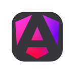

### Hi👋 I'm Jerzy Grzelak, a Frontend Developer and a Coding Trainer.

---

### I find a great joy in building usable, aesthetic and responsive frontend apps that solve actual problems. I'm no stranger to UX and UI design - because recognizing user needs with empathy is a crucial part of the development process. Additionally, I like to play around with data, statistics, and visualizations.

---

**Technologies I have experience with:**
 

 

**Tools I have experience with:**
 

--- 
### Feel free to connect on [LinkedIn](https://www.linkedin.com/in/jerzy-grzelak/)!
